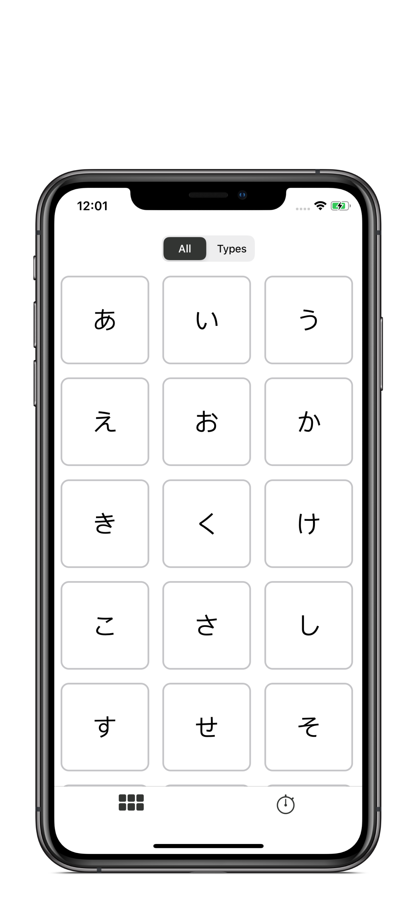
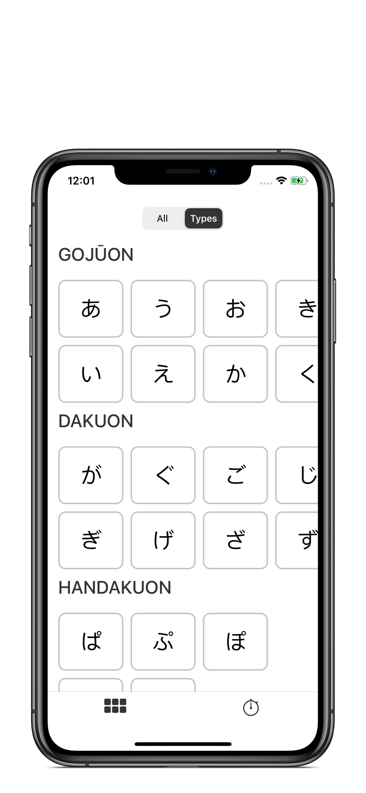
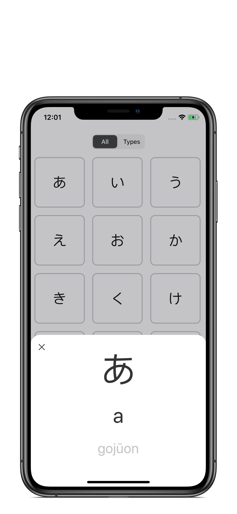
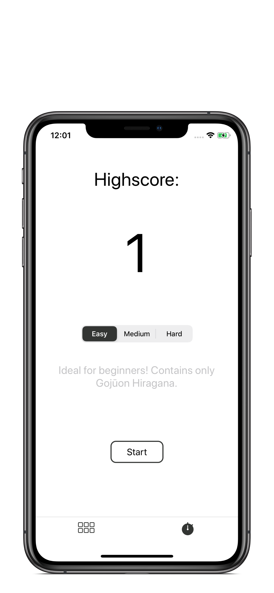
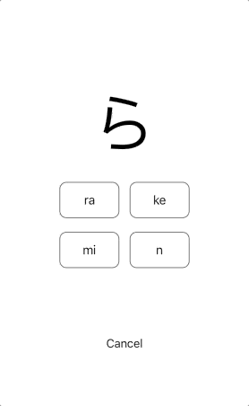

# KanaKana

## Hiragana learning app.

* UIKit 
* Programmatic UI
* Diffable DataSource 
* JSON Persistence
* [Lottie](https://github.com/airbnb/lottie-ios) (3.1.9) 

Purpose of this app is to practice technologies such as a diffable data source and Lottie but mostly so I can learn hiragana without ads. Additionally, practice with performing a network request and processing it to have sections.

One of the challenging parts of this app was creating the different test mode difficulties. The hard difficulty includes all the hiragana in the app but the medium and easy only show certain sections.   

Working with Lottie was brilliant. Installing it through Swift Package Manager makes the process even simpler.

<h2 align= "center"> Hiragana Screens </h2>

<h2 align= "center"> Test Screens </h2> 

<h2 align= "center"> HighScore Animation </h2> 

Acknowledgement: 
The confetti animation was made by [Mark Geyer](https://lottiefiles.com/user/84374).
The animation is open source and can be found on LottieFiles: [LottieFiles](https://lottiefiles.com/7893-confetti-cannons)