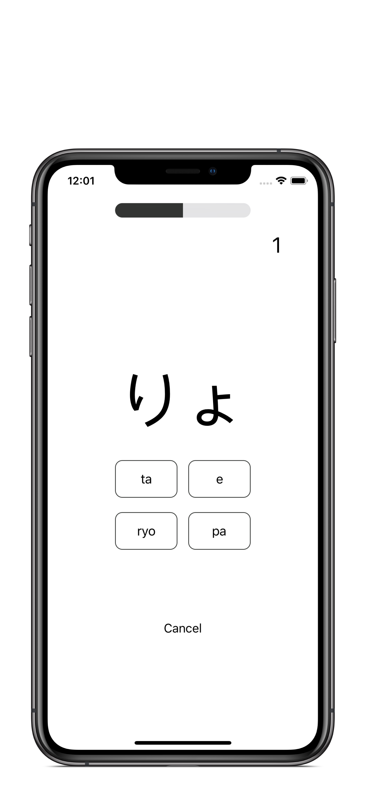

# KanaKana

## Hiragana learning app.

* UIKit 
* Programmatic UI
* Diffable DataSource 
* JSON Persistence
* [Lottie](https://github.com/airbnb/lottie-ios) (3.1.9) 

The purpose of this app is to practice with new technologies such as a diffable data source and Lottie but mostly so I can learn hiragana without ads. Additionally, I ended up learning how to perform a network request and process data to corresponding sections.

One of the challenging parts of this app was creating the different difficulties on the test mode. The hard difficulty includes all the hiragana in the app but the medium and easy only test the user on a simplified section such as Gojūon only.   

Working with Lottie was so simple. Installing it through Swift Package Manager was brilliant.

<h2 align= "center"> Hiragana Screens </h2>

<h2 align= "center"> Test Screens </h2> 

<h2 align= "center"> HighScore Animation </h2> 

Acknowledgement: 
The confetti animation was made by [Mark Geyer](https://lottiefiles.com/user/84374).
The animation is open source and can be found on LottieFiles: [LottieFiles](https://lottiefiles.com/7893-confetti-cannons)